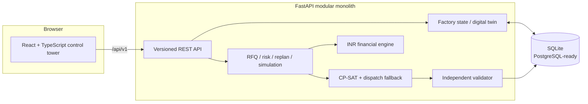

# SmartForge AI

**Finite-capacity scheduling, capable-to-promise, and risk-adjusted production
decision support for a Tier-2 automotive machine shop.**

SmartForge answers a larger question than “what should run next?” It decides whether
new work can be promised without damaging existing commitments, produces a valid
two-week plan, reacts to disruptions, and attaches an INR business case to recovery
actions. The demo models **Sridhar Precision Works**, a 40-person, 14-machine shop in
Hosur with one critical grinding constraint.

> Traditional scheduling tells a factory what to produce. SmartForge determines
> whether work should be accepted, creates a constrained plan, anticipates operational
> risk, replans after disruptions, and explains which action best protects profit and
> customer commitments.

## What makes it more than CRUD

- Finite machine and skill-constrained labour capacity
- Routing precedence and machine eligibility
- Sequence-dependent 20/60/180-minute family changeovers
- Material, maintenance, breakdown, shift, and grid-power calendars
- Three real scheduling policies: **Cheapest**, **Most On-Time**, and **Most Robust**
- Independent schedule validation before a plan is marked feasible
- Capable-to-promise RFQ insertion with commitment-displacement checks
- Risk-adjusted contribution margin and delivery confidence
- Disruption replanning with an auditable before/after schedule diff
- Explainable bottleneck, maintenance, energy, quality, and owner-call recommendations
- Deterministic, reproducible data for 14 machines, ~40 employees, and ~25 orders

The project uses optimization, simulation, and transparent risk rules. It deliberately
does **not** label deterministic seeded calculations as trained machine learning.

## Demo flow

1. Open **Factory Control Tower** to see delivery, profit, factory, and power status.
2. Inspect the **two-week production schedule** and its machine/shift timeline.
3. Enter a new Tier-1 request in **Smart Order Acceptance**.
4. Inject an eight-hour `GRIND-01` breakdown in **Disruption Control**.
5. Replan and inspect moved jobs, new at-risk orders, and incremental cost.
6. Compare **Cheapest / Most On-Time / Most Robust** plans.
7. Open **Risk Control Center** and the simplified multilingual supervisor board.
8. Show the financially justified **Owner's Next Call**.

## Architecture



The modular monolith is intentional: it is simple to run for an assessment while
keeping optimization, validation, finances, persistence, and HTTP concerns separate.
See [architecture](docs/architecture.md) and the [scheduling model](docs/scheduling-model.md).

## Technology

| Layer | Technology | Why |
|---|---|---|
| UI | React, TypeScript, Vite | Fast typed SPA development and an assessment-friendly build |
| Visuals | CSS design system, Recharts, Lucide | Compact industrial dashboards without a heavy UI framework |
| API | Python, FastAPI, Pydantic | Typed validation and self-documenting REST contracts |
| Persistence | SQLAlchemy, SQLite | Zero-config demo; PostgreSQL migration path |
| Optimization | Google OR-Tools CP-SAT | Discrete interval, assignment, and no-overlap constraints |
| Verification | Pytest + schedule validator | Business tests plus independent feasibility checks |

## Quick start

Prerequisites: Node.js 20+, Python 3.11+, and npm.

```bash
make install
make seed
```

Run the API in terminal one:

```bash
make api
```

Run the UI in terminal two:

```bash
make web
```

Open [http://localhost:5173](http://localhost:5173). API documentation is available
at [http://localhost:8000/docs](http://localhost:8000/docs).

To run in containers:

```bash
docker compose up --build
```

No login is required for the deterministic assessment demo. Authentication and role
permissions are identified as production hardening work, not simulated in the UI.

## Verification

```bash
make test      # backend business and feasibility tests
make build     # TypeScript check + production frontend build
make verify    # both
```

Tests cover precedence, machine conflicts/capability, qualified labour, material
release, changeovers, penalties, generator economics, RFQ displacement, and replanning.
The optimizer's output also passes a runtime validator; invalid schedules are returned
as invalid rather than silently displayed.

## API map

All endpoints are under `/api/v1`.

| Workflow | Endpoint |
|---|---|
| Control tower | `GET /dashboard` |
| Factory resources | `GET /machines`, `GET /operators`, `GET /materials` |
| Orders | `GET /orders`, `GET /orders/{order_id}`, `POST /orders` |
| Schedule | `GET /schedule`, `POST /schedule/generate`, `POST /schedule/replan` |
| Plan comparison | `GET /schedule/comparison` |
| Capable-to-promise | `POST /rfq/evaluate` |
| Disruptions | `POST /disruptions` |
| Risks/actions | `GET /risks`, `GET /recommendations` |
| Scenarios | `POST /simulation/run` |
| Analytics | `GET /analytics/capacity`, `/analytics/profitability`, `/analytics/bottlenecks` |

The exact generated schema and request examples are visible in Swagger/OpenAPI at
`/docs` while the API is running.

## Scheduling policies

### Cheapest plan

Minimizes regular operation, overtime, generator, changeover, and expected lateness
cost. It may tolerate low-cost lateness if the recovery action destroys more value.

### Most On-Time plan

Places much higher weight on weighted tardiness and strategic Tier-1/JIT commitments.
Overtime or generator recovery is allowed when its cost is justified by avoided loss.

### Most Robust plan

Prices health and high-utilization exposure, moves critical work ahead of fragile
periods, and protects bottleneck reserve. It targets risk-adjusted profit, not idle
capacity for its own sake.

The UI compares calculated cost, penalties, profit, on-time delivery, overtime,
generator use, and breakdown exposure, then explains its recommended plan. See the
[management memo](docs/tradeoff-memo.md).

## Order acceptance

An RFQ is inserted into a copy of the committed factory state. SmartForge checks its
routing against machine hours, qualified operators, material release, power,
maintenance, health, bottleneck queues, and due-date slack. It evaluates requested-date
feasibility plus overtime, generator, negotiated-date, partial, and outsourcing paths.

```text
expected contribution
- overtime / generator / setup / rework / reliability costs
- new RFQ penalty exposure
- displaced penalty exposure on committed orders
= risk-adjusted contribution
```

The response includes a decision, recommended promise date, delivery confidence,
financial bridge, binding constraints, affected committed orders, and plain-language
reasons. A high-revenue order is rejected if it creates a larger expected loss elsewhere.

## Disruption demo

Use the Disruption Control page or post a breakdown:

```json
{
  "type": "MACHINE_BREAKDOWN",
  "resource": "GRIND-01",
  "start": "2026-09-02T11:00:00",
  "durationHours": 8,
  "notes": "Eight-hour grinding outage"
}
```

Replanning freezes completed operations, preserves work in progress where feasible,
removes damaged capacity, solves the remainder, validates it, and returns an audit diff:
moved operations, machine/shift changes, delivery risk, overtime/generator delta,
penalty increase, lost production, total disruption cost, recovery recommendation, and
the owner's next call.

## Seeded factory

- 5 CNC lathes, 3 mills, 3 drills, 1 grinder, and 2 inspection resources
- Two regular shifts and constrained optional recovery calendars
- Approximately 40 operators with machine qualifications; only 3 can run the grinder
- Approximately 25 Tier-1/Tier-2/Tier-3 orders with different routings and economics
- Deterministic maintenance/failure, quality, material, and power events
- Tension around grinding capacity so trade-offs are visible during a demo

Resetting/re-running the seed uses the same fixed seed and therefore produces comparable
screens and test results.

## Screenshots

The application is designed around these capture points after local startup:

- Factory Control Tower and Action Required panel
- Two-week machine Gantt
- RFQ evaluation with the explainable financial bridge
- Grinder breakdown before/after comparison
- Three-plan decision table
- Kannada/Tamil/English supervisor production board

Add exported images under `docs/screenshots/` before publishing the assessment repository.

## Business concepts implemented

- **Finite Capacity Scheduling:** no infinite machine or labour availability.
- **Theory of Constraints:** expose queue, dependent revenue, and reserve at the current
  bottleneck; recommend exploit/subordinate/elevate actions.
- **ATP/CTP:** promise new work from material and constrained future capacity.
- **OEE:** simplified Availability × Performance × Quality with visible components.
- **Risk-adjusted profitability:** compare expected losses on the same INR basis.
- **Dynamic rescheduling:** preserve execution state and re-optimize only remaining work.
- **Energy-aware planning:** compare generator recovery with avoided commercial loss.
- **Operational digital twin:** one simplified, current model of orders, resources,
  people, inventory, power, and production state—without claiming plant-control fidelity.

## Documentation

- [Architecture](docs/architecture.md)
- [Scheduling formulation](docs/scheduling-model.md)
- [Assumptions and limitations](docs/assumptions.md)
- [Management trade-off memo](docs/tradeoff-memo.md)
- [Live defense guide](docs/defense-guide.md)

## Limitations and next steps

This is a serious assessment system, not a production MES. Demo operation durations,
failure distributions, and commercial rates are generated; batches are simplified;
authentication, audit approval, ERP/MES ingestion, and solver queues are not included.

The production path is to calibrate against real event history, shadow planners,
introduce PostgreSQL and immutable schedule snapshots, add role-based approval/audit,
and evaluate ML only for uncertain inputs such as failure hazard, duration, supplier
lead time, absenteeism, and rework. Feasibility remains the optimizer's job.

---

Built as a Software Developer Intern assessment to demonstrate full-stack engineering,
operations research, manufacturing systems thinking, and explainable business decisions.
