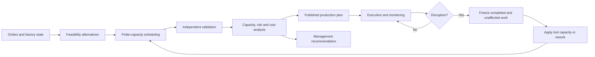
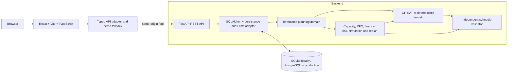

# SmartForge / OptiForge

**Finite-capacity factory scheduling, capable-to-promise, disruption recovery, and risk-adjusted manufacturing decisions in one industrial control tower.**

_One constrained factory model. Three scheduling policies. Every operational decision priced in rupees._

SmartForge is a full-stack manufacturing decision-support application for a Tier-2 automotive machine shop. It turns machines, operator qualifications, material releases, shifts, maintenance, breakdowns, power windows, order economics, and customer priorities into a validated two-week production schedule. The same factory model evaluates new RFQs, identifies bottlenecks and forward risks, replans after disruptions, compares recovery costs, and explains the next management action.

The repository models a deterministic demonstration company, **Sridhar Precision Works in Hosur**: 14 finite-capacity resources, 40 operators, 25 orders, 96 routed operations, and one strategically important grinding constraint. It is an assessment-ready digital-twin simulation, not a claim that the seeded commercial figures or equipment history belong to a real company.

> SmartForge does not use “AI” as a substitute for engineering detail. Its core decisions come from constraint optimization, a validated scheduling heuristic, simulation, and explainable financial/risk rules. No trained machine-learning model is claimed.

## Table of contents

- [Project overview](#project-overview)
- [Business problem](#business-problem)
- [Factory scenario](#factory-scenario)
- [Objectives](#objectives)
- [Implemented capabilities](#implemented-capabilities)
- [Application pages](#application-pages)
- [How the system works](#how-the-system-works)
- [System architecture](#system-architecture)
- [Technology stack](#technology-stack)
- [Frontend architecture](#frontend-architecture)
- [Backend architecture](#backend-architecture)
- [Database design](#database-design)
- [Scheduling and optimization](#scheduling-and-optimization)
- [Schedule validation and constraint handling](#schedule-validation-and-constraint-handling)
- [Financial decision logic](#financial-decision-logic)
- [Order acceptance and capable-to-promise](#order-acceptance-and-capable-to-promise)
- [Capacity planning and bottleneck detection](#capacity-planning-and-bottleneck-detection)
- [Machine health and maintenance logic](#machine-health-and-maintenance-logic)
- [Workforce and skill capacity](#workforce-and-skill-capacity)
- [Power and generator decisions](#power-and-generator-decisions)
- [Quality and rework](#quality-and-rework)
- [Disruption replanning](#disruption-replanning)
- [Risk analysis and recommendations](#risk-analysis-and-recommendations)
- [Scenario simulation](#scenario-simulation)
- [Industry practices represented](#industry-practices-represented)
- [How to use the website](#how-to-use-the-website)
- [Recommended 5–10 minute demo flow](#recommended-510-minute-demo-flow)
- [Live defense scenario](#live-defense-scenario)
- [REST API overview](#rest-api-overview)
- [Project structure](#project-structure)
- [Installation and local setup](#installation-and-local-setup)
- [Environment configuration](#environment-configuration)
- [Deployment](#deployment)
- [Testing and validation](#testing-and-validation)
- [Seeded demo data](#seeded-demo-data)
- [Screenshots](#screenshots)
- [Design and UI](#design-and-ui)
- [Technical decisions](#technical-decisions)
- [Business value](#business-value)
- [Limitations](#limitations)
- [Future enhancements](#future-enhancements)
- [Resume and interview summary](#resume-and-interview-summary)
- [Additional documentation](#additional-documentation)

## Project overview

Most production dashboards report what has already happened. SmartForge is built around the decisions that must happen next:

- Can a new customer order be promised without damaging existing commitments?
- Which machine, operator, shift, and power source should execute each operation?
- Does the plan respect routing precedence, material releases, maintenance, breakdowns, qualifications, and finite capacity?
- Is overtime, generator use, outsourcing, or a later promise economically justified?
- Which bottleneck or single-skill dependency creates the largest expected loss?
- What changes after a grinder failure, operator absence, material delay, power cut, or quality problem?
- Which of the Cheapest, Most On-Time, and Most Robust plans best fits current priorities?

SmartForge answers these questions through one consistent planning model. HTTP endpoints, dashboards, RFQ evaluation, scenarios, risk analysis, and replanning all use the same optimizer-domain objects and financial calculations.

## Business problem

A small automotive machine shop rarely has “just a scheduling problem.” A promise date depends on several interacting realities:

- A machine may be technically capable but unavailable for maintenance.
- A free grinder is not usable if the qualified operator is absent.
- Material may arrive after the earliest production slot.
- A grid outage can make a machine plan infeasible unless generator capacity is available.
- Grouping part families saves setup time, but can delay a high-penalty Tier-1 order.
- Maximizing utilization can remove the reserve needed to recover from a breakdown.
- Accepting a profitable-looking RFQ can displace an existing strategic shipment and destroy more value than it creates.

Spreadsheet capacity totals and unconstrained ERP promise dates do not prove that individual operations fit without collisions. SmartForge models assignments and time explicitly, validates the result independently, and puts operational recovery costs and customer exposure on the same INR basis.

## Factory scenario

The deterministic seed represents **Sridhar Precision Works**, a 40-person machine shop operating a 14-day horizon beginning 1 September 2026.

- 5 CNC lathes, 3 milling machines, 3 drilling resources, 1 grinder, and 2 inspection resources.
- Two regular shifts plus approved overtime and Sunday recovery calendars.
- 40 operators with operation and machine-type qualifications.
- Only 3 grinder-qualified operators, with seeded absence creating a visible skill dependency.
- 25 customer orders across Tier-1, Tier-2, and Tier-3 priorities.
- 96 order operations with machine eligibility, predecessor links, processing times, and part-family setups.
- Materials, inventory allocations, arrivals, maintenance, breakdown history, quality events, and power windows.
- One critical grinding resource, `GRIND-01`, that makes capacity trade-offs easy to inspect.

Seed `20260901` makes the snapshot reproducible. Resetting the seed recreates the same factory state.

## Objectives

1. Produce schedules that respect real finite-capacity constraints.
2. Keep optimizer, validator, finance, risk, and persistence concerns independently testable.
3. Evaluate customer promises against the existing factory state.
4. Compare operational actions using expected profit and avoided loss, not utilization alone.
5. Replan remaining work without rewriting completed history.
6. Explain why a recommendation was generated and which resource or order caused it.
7. Provide management, planning, maintenance, and shop-floor views in one responsive application.
8. Remain deterministic and easy to run for a technical assessment.

## Implemented capabilities

### Planning and optimization

- OR-Tools CP-SAT scheduling with bounded solve time and deterministic parameters.
- Deterministic finite-capacity heuristic for interactive responses and CP-SAT fallback.
- Optional machine/operator/shift alternatives for every operation.
- Machine and operator no-overlap enforcement.
- Routing precedence and material release dates.
- Maintenance, breakdown, shift, overtime, Sunday, and power calendars.
- Shared generator-capacity enforcement.
- Sequence-dependent changeovers through per-machine CP-SAT circuits.
- Robust buffers based on machine health, failure probability, duration, and customer importance.
- Independent post-solve validation before a result is labelled valid.

### Manufacturing decisions

- Smart Order Acceptance / capable-to-promise insertion.
- Delivery-confidence and RFQ-attractiveness scoring.
- Existing-order displacement-penalty checks.
- Cheapest, Most On-Time, and Most Robust plan comparison.
- Machine and skill-constrained capacity calculation.
- Theory-of-Constraints-style bottleneck identification.
- Generator-versus-delay economics.
- Risk-adjusted profitability and per-order economics.
- Current and forward risk detection with expected financial loss.
- Financially justified recommendations and an Owner's Next Call.

### Recovery and simulation

- Machine breakdown, operator absence, material delay, quality failure/rework, and power-cut replanning.
- Completed and unaffected in-progress work frozen for auditability.
- Before/after schedule diff with moved jobs, resource changes, overtime, generator use, and cost.
- Deterministic delivery-confidence simulation.
- What-if scenarios for grinder breakdown, operator absence, power failure, quantity increase, Sunday overtime, a new grinder, cross-training, and outsourced grinding.

### User experience

- Executive and operational control-tower dashboards.
- Interactive production Gantt with filters and operation detail drawer.
- Searchable/filterable order, machine, workforce, capacity, and risk views.
- Risk matrix, cost bridge, capacity bars, health meters, sparklines, tooltips, and expandable insights.
- Responsive desktop, tablet, and mobile layouts.
- English, Kannada, and Tamil shop-floor supervisor board.
- Typed API integration with deterministic demo fallbacks when FastAPI is unavailable.

## Application pages

| Route | Page | Implemented purpose |
|---|---|---|
| `/control-tower` | Factory Control Tower | Operating context, prioritized decisions, factory health, bottleneck, delivery and owner-action summary |
| `/dashboard` | Executive Dashboard | Profit, delivery, utilization, OEE, penalties, output trend, cost structure, risky orders and resource pulse |
| `/risks` | Problems & Risk Center | Current/future risk tabs, severity filters, probability-impact matrix, exposure and action state |
| `/orders` | Orders | Portfolio, status distribution, filters, progress, confidence, revenue and margin |
| `/orders/:orderId` | Order Detail | Operation route, resources, promise/forecast, material readiness and commercial exposure |
| `/acceptance` | Smart Order Acceptance | RFQ input, route selection, decision, confidence, financial bridge and explainable rules |
| `/schedule` | Production Schedule | Two-week machine Gantt with machine, tier, order and risk filters plus operation drawer |
| `/capacity` | Capacity Planning | Available, committed, predicted and remaining machine/skill capacity and bottleneck economics |
| `/plan-comparison` | Schedule Comparison | Three-policy trade-off matrix and management recommendation |
| `/today` | Today's Production Board | Shift cards, issues, start/complete controls, print view and three languages |
| `/disruptions` | Disruption Control Center | Event injection, replanning, schedule difference, cost, lost output and Owner's Next Call |
| `/scenarios` | Scenario Simulator | Baseline comparison for operational and investment what-if cases |
| `/machines` | Machines | Fleet state, load, OEE, health, detail and direct bottleneck opening |
| `/machine-health` | Machine Health | Health ranking, maintenance basis and priority planning |
| `/workforce` | Workforce & Skill Matrix | Availability, qualifications, critical-skill coverage and cross-training case |
| `/energy` | Energy & Power | Power/load timeline, generator economics, approval state and energy intensity |
| `/profitability` | Profitability & Cost | KPI cards, profit bridge, margin drivers and per-order ranking |

Navigation is workflow-oriented: **Command** surfaces decisions, **Plan** manages demand and schedules, **Operate** supports execution and recovery, and **Resources** explains capacity inputs.

## How the system works

1. **Load or generate factory data.** SQLAlchemy initializes the database. With `AUTO_SEED=true`, an empty database receives the deterministic snapshot.
2. **Register machines.** Each resource contributes type, capabilities, power, cost, health, failure probability, status, and unavailable windows.
3. **Register operators and skills.** Operators have shifts, availability, operation skills, machine qualifications, and overtime limits.
4. **Load customers and priorities.** Customer tier, strategic weight, and late penalty determine how delay is valued.
5. **Load orders and routings.** Each order contains sequenced operations, duration, skill, eligible machines, and predecessors.
6. **Resolve material availability.** Inventory and arrival dates become release times. Work cannot start before release.
7. **Build calendars.** Shifts, overtime, Sunday recovery, attendance, maintenance, breakdowns, and power define feasible time windows.
8. **Adapt ORM records.** The optimizer receives immutable dataclasses instead of holding an open database session.
9. **Generate alternatives.** For every operation, SmartForge enumerates compatible machines, qualified operators, shifts, power sources, and recovery flags.
10. **Solve the finite schedule.** CP-SAT or the heuristic selects assignments and times while respecting hard constraints.
11. **Apply sequence effects.** Part-family transitions consume 20, 60, or 180 minutes plus setup cost.
12. **Validate independently.** Every task, resource interval, precedence edge, calendar, power window, overtime flag, and changeover is checked.
13. **Calculate capacity.** Available, committed, predicted, queued, and remaining capacity are calculated by resource and skill.
14. **Detect bottlenecks and risks.** High utilization, low slack, poor health, single-skilled staffing, material timing, and lateness become explainable risks.
15. **Calculate economics.** Revenue, labour, machine, energy, generator, setup, rework, maintenance, outsourcing, and penalties are priced.
16. **Publish the plan.** The frontend presents schedule, capacity, confidence, profit, risks, and recommendations.
17. **Apply a disruption.** A breakdown, absence, material delay, quality failure, or power cut changes the problem from the event time forward.
18. **Freeze history and replan.** Completed and unaffected in-progress work remain fixed; pending work is solved and validated again.
19. **Explain the delta.** SmartForge reports moved jobs, resource changes, overtime, generator hours, penalties, output, and disruption cost.
20. **Recommend coordination.** The Owner's Next Call identifies the contact that unlocks the most important recovery action.



## System architecture

SmartForge is a modular monolith: one React SPA, one FastAPI application, one relational database, and explicit domain/service boundaries.



The optimizer is independent of FastAPI and SQLAlchemy. A future solver worker or multi-service deployment can reuse the domain and service layers.

## Technology stack

| Layer | Technology | Role |
|---|---|---|
| Frontend | React, TypeScript, Vite | Typed SPA and production build |
| Routing | React Router | Workflow routes and parameterized order detail |
| Motion | Motion for React | Reduced-motion-aware transitions and disclosures |
| Charts | Recharts | Output, cost, risk, energy, profitability and health visuals |
| Icons | Lucide React | Consistent industrial iconography |
| Backend | Python 3.11+ / FastAPI | REST endpoints, initialization and OpenAPI |
| Contracts | Pydantic | Request/response validation and aliases |
| Persistence | SQLAlchemy 2 | Relational models and SQLite/PostgreSQL portability |
| Optimization | Google OR-Tools CP-SAT | Assignment, interval, circuit and objective model |
| Fallback | Deterministic dispatch heuristic | Fast interactive generation and solver recovery |
| Testing | Pytest, TestClient/httpx | Unit, integration, financial and API checks |
| Packaging | Docker, Nginx, Compose | Local two-service deployment |
| Cloud | Vercel Services | Vite and FastAPI behind one `/api` origin |

## Frontend architecture

The frontend lives under `frontend/src`.

- `App.tsx` defines all routes and lazy-loads page bundles.
- `components/Layout.tsx` provides grouped navigation, top bar, live context, mobile drawer, footer, and connection status.
- `components/UI.tsx` contains common panels, badges, progress, formatting, and KPI compatibility.
- `components/Analytics.tsx` contains metric cards, sparklines, chart tooltips, radial meters, range selectors, expandable analysis, and live status.
- `components/CommandPalette.tsx` provides keyboard/search navigation.
- `pages/` groups views by business workflow.
- `services/api.ts` is the typed transport boundary and normalizes backend payloads.
- `data/demo.ts` is a deterministic presentation fallback. Read pages remain usable when FastAPI is offline; RFQ, disruption, and scenario actions also have calculated local fallbacks.
- `types/` defines frontend domain contracts.
- `styles.css` implements the industrial design system and responsive breakpoints.

The header displays **Live** or **Demo data**. Some approval-style buttons—planning maintenance, activating a plan, acknowledging a risk, or approving the displayed generator plan—update only the current UI demonstration state. They do not claim to persist an ERP/MES transaction.

## Backend architecture

| Package | Responsibility |
|---|---|
| `api/` | FastAPI routers, input validation, ORM-to-domain loading, and transport payloads |
| `models/` | SQLAlchemy tables and relationships |
| `schemas/` | Pydantic read/create contracts |
| `optimizer/` | Planning domain, CP-SAT/heuristic scheduler, and validator |
| `services/` | Capacity, finance, energy, RFQ, risk, comparison, simulation, and replanning |
| `seed/` | Deterministic factory, schedule, event, and commercial dataset |

`app.main:app` creates tables, optionally seeds an empty database, applies CORS, exposes OpenAPI at `/api/docs`, and registers the `/api` router.

The optimizer does not import the web framework or hold database sessions. `problem_from_records` adapts ORM rows into immutable `PlanningProblem`, `Machine`, `Operator`, `Order`, `Operation`, `CalendarWindow`, `PowerWindow`, `ChangeoverRule`, and `CostConfig` objects.

## Database design

| Area | Entities | Purpose |
|---|---|---|
| Equipment | `Machine`, `MachineCapability`, `MachineBreakdown`, `MaintenanceWindow` | Capability, performance, failure history, and unavailable windows |
| Workforce | `Shift`, `Operator`, `OperatorSkill`, `OperatorAvailability` | Qualified labour calendars and overtime rules |
| Inventory | `Material`, `Inventory`, `MaterialArrival` | Stock, allocation, safety stock, and incoming supply |
| Demand | `Customer`, `PartFamily`, `ProductionOrder` | Commercial commitment, part family, tier, material, and economics |
| Routing | `OrderOperation`, `OperationMachineEligibility` | Predecessors, required skill, duration, and eligible resources |
| Planning | `Schedule`, `ScheduleOperation`, `ChangeoverMatrix` | Assigned plan, baseline link, cost flags, and family transitions |
| Events | `PowerEvent`, `Disruption`, `QualityEvent` | Grid/generator windows, exceptions, and rework/scrap facts |
| Decisions | `RFQ`, `RFQOperation`, `Recommendation`, `CostConfiguration` | Candidate demand, evaluation, actions, and rates |

Key relationships include `Customer 1 → many ProductionOrder`, `ProductionOrder 1 → many OrderOperation`, operation-to-machine eligibility through an association table, and `ScheduleOperation → OrderOperation + Machine + Operator + Shift`. Disruptions optionally reference the affected machine, operator, order, or material.

SQLite foreign-key enforcement is enabled. PostgreSQL URLs are normalized to psycopg 3.

## Scheduling and optimization

### Decision model

For every unfinished operation, the scheduler decides a compatible machine, qualified operator, shift/calendar alternative, start/end time, power source, recovery flags, and machine sequence. CP-SAT uses integer start/end variables, Boolean candidate-presence variables, optional machine/operator intervals, generator cumulative intervals, completion/lateness variables, and circuit arcs.

### Hard constraints actually enforced

1. Exactly one candidate assignment per scheduled operation.
2. Machine compatibility and explicit eligibility.
3. Operator skill, machine qualification, status, and availability.
4. No machine double-booking.
5. No operator double-booking.
6. Operation precedence for every predecessor.
7. Start no earlier than material/order release.
8. Execution inside a valid shift or approved recovery window.
9. No overlap with maintenance or breakdowns.
10. Powered work only with grid or adequate generator power.
11. Shared generator demand within capacity.
12. Sequence-dependent setup separation.
13. Overtime limits and correct overtime/Sunday labels.
14. Frozen completed/unaffected work preserved during replanning.
15. Robust reserve occupying machine capacity in Most Robust mode.

### Three schedule modes

#### Cheapest

`CHEAPEST` gives full weight to assignment cost and direct late penalties. It minimizes regular operation, labour, overtime, power, generator, and setup cost. It may tolerate low-value lateness when recovery costs more than exposure.

#### Most On-Time

`MOST_ON_TIME` raises the lateness coefficient using customer tier and strategic weight. It is more willing to select overtime or a higher-cost resource to protect an important promise.

#### Most Robust

`MOST_ROBUST` adds machine reserve and prices failure probability and low health. The buffer uses configured reserve ratio, failure probability, health, duration, and a Tier-1 factor. It favors strategic work earlier and leaves recovery space.

### Objective and solver policy

The CP-SAT objective is a mode-weighted sum of assignment/machine/labour/energy cost, overtime/Sunday and generator premiums, weighted lateness, sequence-dependent changeover, and robust failure/health exposure. Policy preference never relaxes hard constraints.

Interactive RFQ, replan, simulation, profitability, and comparison endpoints intentionally use the deterministic heuristic for predictable response time. `POST /api/schedule/generate` accepts `exact=true` for bounded CP-SAT. CP-SAT runs with a fixed seed, one worker, and a time limit. If it returns `UNKNOWN` without an incumbent, SmartForge discloses that and applies the heuristic instead of falsely claiming infeasibility.

The heuristic dispatches only ready operations, ranks them by mode-specific due date/tier/penalty/risk logic, finds the earliest feasible machine/operator/shift/power allocation, reserves setups and buffers, then passes through the same validator and finance service.

## Schedule validation and constraint handling

`ScheduleValidator` is independent of the scheduling engine. It reports structured violations for missing/duplicate assignments, capability and skill mismatch, material release, precedence, resource overlap, downtime, shift/overtime labels, setup separation, power source, generator overload, overtime limits, and horizon bounds.

API responses include `valid`, solver/status metadata, diagnostics, and violation messages. An invalid result is displayed as infeasible/escalated rather than silently published.

## Financial decision logic

All primary economics are calculated in INR from task timestamps and configured rates.

```text
Expected Profit
= Revenue
− Material Cost
− Regular Labour
− Overtime Labour
− Machine Operating Cost
− Grid Energy
− Generator Energy
− Changeover Cost
− Maintenance Cost
− Expected Rework Cost
− Outsourcing Cost
− Late-Delivery Penalties
```

Revenue is recognized only when every operation in the route is scheduled. Lateness is continuous elapsed time multiplied by the daily penalty rate; a whole-started-day helper also exists.

```text
Expected Rework = Quantity × Reject Rate × Rework Cost per Unit

Disruption Cost = Lost Production + Added Overtime + Penalty Increase
                + Extra Changeover + Extra Generator
```

### Why utilization is not maximized

Running every machine near 100% can reduce resilience, increase setups, force overtime, consume fuel, and expose strategic orders. A drill at 60% may not matter if the only grinder is at 96%. SmartForge values due dates, penalties, constrained contribution, health, and reserve—not utilization for its own sake.

Tier and strategic weight increase delay priority. They do not create unlimited recovery spending: overtime, generator, outsourcing, and setup are still priced. A new high-revenue order can be rejected if it creates a larger loss on existing commitments.

## Order acceptance and capable-to-promise

Smart Order Acceptance inserts a proposed RFQ into a copy of the committed problem and schedules the combined order book. It checks routing, eligible machine hours, bottleneck capacity, operator coverage, material timing, maintenance/breakdowns, power/generator, changeovers, quality/reliability exposure, completion, penalty displacement, and incremental profit.

Delivery confidence uses completion slack, machine failure probability, operator redundancy, quality rate, overtime, and generator dependence. The attractiveness score combines expected contribution, penalties, overtime, generator, setup, reliability, displacement, and strategic value.

| Decision | Meaning |
|---|---|
| `ACCEPT` | Entire route fits regular valid capacity before the requested date |
| `ACCEPT WITH OVERTIME` | Qualified overtime preserves the date and remains profitable |
| `ACCEPT WITH GENERATOR USAGE` | Generator dispatch is required and covered by margin |
| `ACCEPT WITH NEGOTIATED DELIVERY DATE` | A valid route exists but earliest completion is after the request |
| `ACCEPT WITH PARTIAL DELIVERY` | Only a defensible fraction fits remaining capacity |
| `OUTSOURCE BOTTLENECK OPERATION` | External bottleneck work costs less than gross contribution |
| `REJECT` | Feasibility, displacement, or incremental economics do not support a promise |

The UI presents the decision, delivery-confidence ring, attractiveness, financial bridge, capacity gates, affected commitments, and expandable reasoning.

## Capacity planning and bottleneck detection

```text
Available machine minutes
= union of eligible shift minutes with qualified labour
− overlapping maintenance/breakdown minutes
```

Committed minutes include task duration, robust buffer, and setup time. Predicted capacity discounts availability by failure probability; queue time is compatible unscheduled work. Skill capacity compares qualified operator hours with required operation hours.

The bottleneck service reports machine/type, utilization, queue, dependent orders, Tier-1 work, dependent revenue, explanation, and exploit/subordinate/elevate-style actions such as sequencing, targeted overtime, maintenance, or outsourcing.

## Machine health and maintenance logic

The machine master contains health, failure count, OEE components, MTBF, MTTR, running hours, last service, breakdown history, and planned maintenance. The UI explains maintenance priority through service interval, failures/downtime, MTBF trend, load, and critical-order exposure.

Backend risk analysis combines failure probability and low health, finds scheduled dependent orders, and estimates exposed revenue. This is transparent rule-based decision support, not predictive-maintenance machine learning or a safety control.

## Workforce and skill capacity

Each operation needs one qualified, available operator for its complete interval. Qualifications can constrain operation skill, machine type, or machine ID. Operator intervals cannot overlap; overtime respects eligibility and limits.

The Workforce page shows presence, grinding coverage, overtime eligibility, skill coverage, Level 1–3 qualification, search/shift filters, and a cross-training business case. Backend risk analysis creates labour risk when only one usable operator covers scheduled dependent work.

## Power and generator decisions

Power windows state grid/generator availability, capacity, and rates. A machine alternative is rejected when power cannot be covered. Simultaneous generator work is checked against shared capacity.

```text
Benefit = Avoided Penalty + Protected Contribution Margin
Cost    = Generator Energy + Additional Operating Cost
Run generator when Benefit > Cost
```

The Energy page demonstrates selective generator economics. Its approval button is local presentation state, not a persisted switchgear command.

## Quality and rework

Quality events contain inspected, rejected, rework and scrap quantities, root cause, cost, and schedule impact. Expected quality loss is also priced per order. A quality disruption appends a rework operation to the affected route, so recovery consumes real eligible machine, operator, shift, and power capacity.

## Disruption replanning

Supported disruption types are machine breakdown, operator absence, material delay, quality rejection/rework, and power cut.

At the event timestamp SmartForge freezes completed and unaffected in-progress work, releases affected/pending work, applies lost capacity or rework, prevents back-scheduling before the event, regenerates the remainder, validates it, and compares it with baseline.

The diff includes moved jobs, machine/shift changes, new overtime, generator time, deliveries at risk, completion dates, lost output, cost bridge, solver policy, violations, and revised schedule.

## Risk analysis and recommendations

Implemented rules detect already-late work, low delivery slack, highly loaded machines, poor-health/high-failure machines, single-qualified-operator dependencies, and material releases near due dates.

Every risk includes timing, severity, category, probability, expected financial loss, affected orders/machines, delivery impact, action, and justification. Recommendations estimate cost, benefit, and net benefit. The risk center adds current/future tabs, severity filtering, probability-impact matrix, and expandable action cards.

The Owner's Next Call maps the highest exposure to a maintenance contractor, supplier, workforce/training lead, customer planner, utility/generator contractor, or outsourcing vendor.

## Scenario simulation

| Scenario | Modeled change |
|---|---|
| Grinder breakdown | Adds grinding outage and replans |
| Operator absence | Removes qualified grinder operators |
| Power failure | Adds grid outage with bounded generator recovery |
| Quantity increase | Increases target quantity, revenue, material, and duration |
| Sunday overtime | Adds Sunday recovery for eligible operators |
| New grinder | Adds one or two healthy grinding resources and eligibility |
| Cross-train | Adds grinding qualifications to available operators |
| Outsource | Adds an external grinding lane and outsourcing cost |

Breakdown and power cases also run deterministic seeded delivery-confidence trials. Results compare delivery, revenue, cost, profit, penalties, overtime, utilization, and bottleneck load against the robust baseline.

## Industry practices represented

- **Finite-capacity scheduling:** real machine and operator intervals.
- **Theory of Constraints:** constrained load, dependent revenue, queue, and reserve.
- **OEE:** simplified Availability × Performance × Quality.
- **Preventive maintenance:** maintenance removes capacity and is weighed against exposure.
- **Dynamic rescheduling:** history is frozen while pending work is recalculated.
- **Sequence optimization:** family transitions consume different setup times/costs.
- **Skills-based planning:** capacity exists only with qualified labour.
- **Capable-to-promise:** new demand is tested against current commitments.
- **Risk-adjusted profitability:** expected loss and recovery are compared in INR.
- **Scenario planning:** operating/investment interventions are compared with baseline.
- **Simplified digital twin:** resources, people, materials, orders, power, and events share one state.

## How to use the website

### Factory Control Tower

Open `/control-tower`. Read the operating strip first: schedule validity, constraint, decision queue, and sync state. The hero and action panels prioritize decisions and link to risks, schedule, and order acceptance.

### Executive Dashboard

Open `/dashboard`. Read profit, delivery, utilization, OEE, and penalty exposure. Hover/focus KPI cards, switch 3D/7D output, expand **Insight**, inspect cost structure and risky orders, then use **Compare plans**.

### Orders and order detail

Open `/orders`. Click the status distribution, search by order/customer/part, and filter by tier/status. Compare progress, due date, forecast, confidence, revenue, and margin. Open an order for its routed timeline, resources, material allocation, and commercial case. **Show in schedule** filters the Gantt to that order.

### Smart Order Acceptance

Open `/acceptance` and use the seeded example or enter a new customer/part, tier, quantity, requested date, selling price, late penalty, material state, and route. Press **Evaluate order**. Read the six gates, recommendation, confidence, attractiveness, contribution/cost bridge, and capacity checks. Expand **Why this recommendation**.

- **ACCEPT:** regular valid capacity supports the date.
- **OVERTIME / GENERATOR:** justified recovery is required.
- **NEGOTIATED / PARTIAL:** change the promise or quantity.
- **OUTSOURCE:** external bottleneck capacity is economically preferable.
- **REJECT:** risk or feasibility makes the promise unsafe.

### Production Schedule

Open `/schedule`. Rows are machines; columns are days/shifts. Bar styles distinguish production, setups, maintenance, and risk. Filter by machine type, tier, order, or at-risk status. Click a bar for operation, resource, day, shift, duration, validation, and order link.

### Schedule Comparison

Open `/plan-comparison`. Select Cheapest, Most On-Time, or Most Robust and compare production cost, overtime, penalties, generator, setups, delivery, profit, failure exposure, and reserve. The **Activate** control demonstrates selection locally; it does not persist to an MES.

### Problems & Risk Center

Open `/risks`. Switch current/future tabs, filter severity, and read the probability-impact matrix. Expand a card for action, affected resources, likelihood, and financial justification. Approval is a local demo acknowledgment.

### Disruption Control

Open `/disruptions`. Choose breakdown, absence, material delay, rework, or power cut; confirm resource, start, duration, and notes; then press **Inject event & replan**. Review validity, jobs moved, overtime, penalties, lost output, before/after rows, and Owner's Next Call.

### Resources and analytics

- **Capacity:** machine/skill availability and `GRIND-01` economics.
- **Machines:** fleet status/load/OEE/health; filters and direct bottleneck focus.
- **Machine Health:** health ranking and maintenance priority.
- **Workforce:** presence, qualifications, coverage, shifts, and cross-training.
- **Energy:** power/load curves and generator economics.
- **Profitability:** revenue/profit/penalty KPIs, bridge, and order ranking.

### Shop-floor view

Open `/today`. Choose English, Kannada, or Tamil. Cards show machine, time, order, part, quantity, and issue. Start/complete buttons update local shift state; held jobs remain blocked. Use **Print** for handoff.

### Scenario Simulator

Open `/scenarios`, select an intervention, adjust magnitude, and run it. Compare delivery, cost, profit, penalty, overtime, utilization, and bottleneck load against baseline. Investment cards show deterministic assessment assumptions for training, a new grinder, and outsourcing.

## Recommended 5–10 minute demo flow

1. **Executive (45 sec):** profit, delivery, OEE, and penalty exposure.
2. **Control Tower (45 sec):** show decision prioritization.
3. **Risks (45 sec):** open the top critical exposure.
4. **Schedule (60 sec):** show Gantt filters, operation drawer, and validation.
5. **Order Acceptance (90 sec):** evaluate the seeded Tier-1 RFQ and explain confidence/economics.
6. **Disruption (90 sec):** inject the eight-hour `GRIND-01` breakdown and replan.
7. **Difference (45 sec):** moved work, overtime/penalty delta, output, and cost.
8. **Owner's Next Call (30 sec):** identify the contact and protected value.
9. **Plan Comparison (60 sec):** explain why cheapest is not automatically best.
10. **Capacity/Workforce (45 sec):** close with grinder and skill constraints.

## Live defense scenario

> `GRIND-01` fails for eight hours. One grinder operator is absent. A strategic Tier-1 order is due soon.

1. Show critical grinding load in **Capacity**.
2. Show three qualified/two available context in **Workforce**.
3. Identify Tier-1 penalty exposure in **Orders** or **Risks**.
4. Open **Disruptions**, keep `GRIND-01` and `8 h`, and run replanning.
5. Show schedule validity, moved jobs, overtime, penalties, output, and before/after operations.
6. Read the Owner's Next Call.
7. Open **Plan comparison** to explain cost versus reserve.

Explain that history is frozen, the grinder receives an unavailable interval, all original constraints are solved again, the validator checks the result, and incremental recovery cost is separated from baseline. The default note mentions operator absence, but the API models one primary disruption per request; absence can be run separately in Disruptions or Scenarios.

## REST API overview

Default prefix: `/api`. Swagger: `/api/docs`. ReDoc: `/api/redoc`. OpenAPI: `/api/openapi.json`.

### Health and dashboard

| Method | Endpoint | Description |
|---|---|---|
| GET | `/health` | Database-backed service health |
| GET | `/api/dashboard` | Executive KPIs, factory status, bottleneck, and alerts |

### Resources and master data

| Method | Endpoint | Description |
|---|---|---|
| GET | `/api/machines` | Machine summaries |
| GET | `/api/machines/{machine_id}` | Capabilities, breakdowns, and maintenance |
| GET | `/api/operators` | Operators, shifts, status, and skills |
| GET | `/api/materials` | Materials and inventory summaries |
| GET | `/api/materials/{material_id}` | Inventory and arrivals for one material |
| GET | `/api/customers` | Customer master |
| GET | `/api/part-families` | Part families |
| GET | `/api/shifts` | Shift calendars |
| GET | `/api/cost-config` | Configured rates |
| GET | `/api/power` | Power events and generator availability |

### Orders and RFQ

| Method | Endpoint | Description |
|---|---|---|
| GET | `/api/orders` | Order summaries |
| GET | `/api/orders/{order_id}` | Order route and economics |
| POST | `/api/orders` | Create an order after request/FK validation |
| POST | `/api/rfq/evaluate` | Decision, confidence, economics, and constraints |

### Scheduling and replanning

| Method | Endpoint | Description |
|---|---|---|
| GET | `/api/schedule` | Active persisted schedule |
| POST | `/api/schedule/generate` | Live generation; `exact=true` requests CP-SAT |
| POST | `/api/schedule/replan` | Disruption and revised schedule/diff |
| POST | `/api/disruptions` | Disruption injection/replanning workflow |
| GET | `/api/schedule/comparison` | Live three-mode comparison |
| GET | `/api/schedule/comparison/snapshot` | Persisted comparison snapshot |

### Analytics and simulation

| Method | Endpoint | Description |
|---|---|---|
| GET | `/api/analytics/capacity` | Machine/type/bottleneck capacity |
| GET | `/api/analytics/bottlenecks` | Bottleneck explanation and metrics |
| GET | `/api/analytics/profitability` | Live schedule financial summary |
| GET | `/api/risks` | Current/future risks |
| GET | `/api/recommendations` | Financially justified actions |
| POST | `/api/simulation/run` | Supported scenario against robust baseline |

Request examples should be taken from generated OpenAPI so they cannot drift from the current Pydantic contracts.

## Project structure

```text
SmartForge-AI/
├── .env.example
├── Makefile
├── README.md
├── docker-compose.yml
├── vercel.json
├── backend/
│   ├── app/
│   │   ├── api/                 # FastAPI routers and HTTP adapters
│   │   ├── core/                # Settings, database, enums
│   │   ├── models/              # SQLAlchemy entities
│   │   ├── optimizer/           # Domain, scheduler, validator
│   │   ├── schemas/             # Pydantic contracts
│   │   ├── seed/                # Deterministic factory seed
│   │   ├── services/            # Capacity, finance, RFQ, risk, replan, simulation
│   │   └── main.py
│   ├── tests/                   # 21 backend tests
│   ├── Dockerfile
│   └── requirements*.txt
├── frontend/
│   ├── src/
│   │   ├── components/          # Layout, palette, UI, analytics
│   │   ├── data/                # Deterministic fallbacks
│   │   ├── i18n/                # EN/KN/TA board strings
│   │   ├── pages/               # Workflow views
│   │   ├── services/            # Typed API adapter
│   │   ├── types/               # Frontend contracts
│   │   ├── App.tsx
│   │   └── styles.css
│   ├── Dockerfile
│   ├── nginx.conf
│   └── package*.json
└── docs/
    ├── architecture.md
    ├── assumptions.md
    ├── defense-guide.md
    ├── scheduling-model.md
    ├── tradeoff-memo.md
    └── screenshots/
```

Analytics are implemented in `backend/app/services`, `backend/app/api/analytics.py`, and frontend analytics components/pages; there is no separate root analytics package.

## Installation and local setup

### Prerequisites

- Git
- Python 3.11+
- Node.js 20+ and npm
- Optional: Docker with Compose
- Optional for durable production: PostgreSQL

### macOS or Linux

```bash
git clone https://github.com/rajath0045/SmartForge-AI.git
cd SmartForge-AI
make install
make seed
```

Start FastAPI in terminal 1:

```bash
make api
```

Start Vite in terminal 2:

```bash
make web
```

Open:

- Website: [http://localhost:5173](http://localhost:5173)
- Swagger: [http://localhost:8000/api/docs](http://localhost:8000/api/docs)
- Health: [http://localhost:8000/health](http://localhost:8000/health)

Local defaults require no environment variables.

### Manual backend

```bash
python3 -m venv backend/.venv
source backend/.venv/bin/activate
pip install -r backend/requirements-dev.txt
cd backend
python -m app.seed
uvicorn app.main:app --reload --port 8000
```

`python -m app.seed --reset` intentionally drops and recreates SmartForge tables in the configured database.

### Manual frontend

```bash
cd frontend
npm install
npm run dev
```

### Windows PowerShell

```powershell
git clone https://github.com/rajath0045/SmartForge-AI.git
Set-Location SmartForge-AI
py -m venv backend\.venv
backend\.venv\Scripts\Activate.ps1
pip install -r backend\requirements-dev.txt
Set-Location backend
python -m app.seed
uvicorn app.main:app --reload --port 8000
```

Second PowerShell window:

```powershell
Set-Location SmartForge-AI\frontend
npm install
npm run dev
```

### Docker Compose

```bash
docker compose up --build
```

The SPA is at `http://localhost:5173`, FastAPI at `http://localhost:8000`, Nginx proxies `/api/`, and SQLite persists in the `smartforge-data` volume.

## Environment configuration

| Variable | Example/default | Used by | Meaning |
|---|---|---|---|
| `DATABASE_URL` | `sqlite:///./smartforge.db` | Backend | SQLAlchemy URL; PostgreSQL supported |
| `API_PREFIX` | `/api` | Backend | Non-root router/docs prefix |
| `AUTO_SEED` | `true` | Backend | Seed an empty database on startup |
| `CORS_ORIGINS` | `http://localhost:5173` | Backend | Comma-separated exact origins |
| `VITE_API_URL` | local backend URL or `/api` | Frontend build | Compiled API base URL |

Backend settings are read from process environment; the project does not automatically load the root `.env.example`. Export values, configure the run profile, or use Compose.

```bash
export DATABASE_URL='sqlite:///./smartforge.db'
export AUTO_SEED='true'
export CORS_ORIGINS='http://localhost:5173'
make api
```

For Vite overrides, create untracked `frontend/.env.local`:

```text
VITE_API_URL=http://localhost:8000/api
```

For production, use `VITE_API_URL=/api`, store `DATABASE_URL` in encrypted host settings, and add `CORS_ORIGINS` only for cross-origin callers. `VERCEL` is platform-provided and only selects `/tmp/smartforge.db` if no database URL exists. Never commit secrets.

## Deployment

The root `vercel.json` defines two Vercel services:

1. **frontend:** root `frontend`, Vite framework, SPA fallback to `index.html`.
2. **backend:** root `backend`, FastAPI entrypoint `app.main:app`.

Global rewrites send `/api/(.*)` to FastAPI and all other routes to React. Recommended variables:

```text
VITE_API_URL=/api
API_PREFIX=/api
AUTO_SEED=true
DATABASE_URL=postgresql://<user>:<password>@<host>/<database>?sslmode=require
```

If `DATABASE_URL` is omitted on Vercel, `/tmp/smartforge.db` supports an ephemeral demo but is not durable/shared. Use managed PostgreSQL for production persistence. Startup seeding uses a PostgreSQL advisory transaction lock to avoid concurrent duplicate initialization.

### GitHub → Vercel

1. Push this repository to GitHub.
2. Import `rajath0045/SmartForge-AI` into **one** Vercel project.
3. Keep the project at repository root so `vercel.json` is detected.
4. Add environment variables to Production/Preview.
5. Deploy and verify `/health`, `/api/docs`, `/dashboard`, `/schedule`, `/acceptance`, and refresh a nested SPA route.
6. Future pushes to the connected production branch create deployments for the same project; do not create duplicate projects.

The backend image uses Python 3.12-slim/Uvicorn. The frontend builds on Node 22 Alpine and serves through Nginx 1.27 Alpine with SPA and `/api/` proxy support.

## Testing and validation

```bash
make test      # 21 backend tests
make build     # TypeScript + Vite production build
make verify    # both
```

```bash
cd frontend
npm run typecheck
npm run build
```

```bash
cd backend
.venv/bin/pytest -q
```

Automated tests cover seeded ORM adaptation, complete finite schedules, precedence, material release, capability/skill, resource conflicts, downtime, power, shared generator capacity, sequence setups, robust reserve, CP-SAT and fallback behavior, financial buckets, route-complete revenue, generator economics, RFQ profitability, disruption freezing/replanning, capacity/risk/recommendations, deterministic simulation, and API contracts.

The full seeded problem contains 96 optimizer operations. API integration tests require schedule/recovery responses to be valid with no violations.

## Seeded demo data

| Entity | Count |
|---|---:|
| Machines | 14 |
| Operators | 40 |
| Grinder-qualified operators | 3 |
| Customer orders | 25 |
| Routed operations | 96 |
| Customers | 8 |
| Part families | 6 |
| Materials | 6 |
| Shifts | 4 |
| Breakdown rows | 43 |
| Maintenance windows | 14 |
| Quality events | 4 |
| Power events | 2 |

The seed also includes customer tiers/penalties, OEE and health data, absences and overtime limits, material allocations/arrivals, 20/60/180-minute transition rules, disruptions, recommendations, RFQ data, cost configuration, schedule snapshots, and a 180 kW generator. Values are demonstration assumptions and require real calibration.

## Screenshots

Real captures should be stored under `docs/screenshots/`. No fabricated images are included.

| Capture | Intended relative path |
|---|---|
| Executive Dashboard | `docs/screenshots/executive-dashboard.png` |
| Factory Control Tower | `docs/screenshots/factory-control-tower.png` |
| Smart Order Acceptance | `docs/screenshots/smart-order-acceptance.png` |
| Production Gantt | `docs/screenshots/production-gantt.png` |
| Problems & Risk Center | `docs/screenshots/risk-center.png` |
| Machine Health | `docs/screenshots/machine-health.png` |
| Capacity Planning | `docs/screenshots/capacity-planning.png` |
| Disruption/Replanning | `docs/screenshots/disruption-replan.png` |
| Schedule Comparison | `docs/screenshots/schedule-comparison.png` |

When real captures are added, replace the table with verified Markdown image links.

## Design and UI

The interface uses a restrained industrial SaaS language:

- obsidian/neutral surfaces with warm metal accents;
- strong hierarchy and compact operating labels;
- reusable panels, badges, metrics, capacity, chart, and status primitives;
- 21st.dev-inspired interaction patterns implemented in repository-owned React components;
- counters, deterministic sparklines, tooltips, range selectors, and expandable analysis;
- radial health meters and probability-impact risk visualization;
- dense but readable tables/timelines;
- subtle Motion transitions and `prefers-reduced-motion` support;
- focusable cards, semantic tabs/buttons, dialog roles, accessible labels, and text-backed status;
- desktop, tablet, and 390 px mobile layouts without page-level horizontal overflow in QA.

It avoids fake chat, random gradients, excessive glass effects, and distracting animation.

## Technical decisions

### React, TypeScript, and Vite

Interactive filters, disclosures, Gantt views, and charts benefit from component composition. TypeScript protects transport/page contracts; Vite keeps local and production builds simple.

### FastAPI and Pydantic

FastAPI provides typed, testable endpoints and OpenAPI. Pydantic rejects malformed decisions before they reach planning logic.

### SQLAlchemy and SQLite/PostgreSQL

SQLAlchemy preserves relationships while avoiding database lock-in. SQLite makes the demo zero-configuration; PostgreSQL supports durable hosted deployment.

### OR-Tools CP-SAT

Job-shop scheduling is discrete. Optional intervals, no-overlap, exact-one assignment, circuits, cumulative capacity, and weighted objectives match the implemented constraints better than spreadsheet arithmetic.

### Validated heuristic

Interactive use needs a valid response when native solver binaries are unavailable or bounded search finds no incumbent. The deterministic heuristic is finite-capacity, independently validated, and disclosed in response metadata.

### Modular monolith

Separate microservices would add deployment and consistency overhead at this scale. Package boundaries already isolate persistence, scheduling, validation, finance, risk, and HTTP and can be extracted later.

## Business value

With calibrated factory data, this approach can reduce late penalties, unnecessary overtime, low-value generator expense, poor capacity allocation, avoidable setups, badly timed maintenance, and unprofitable order acceptance. It can improve delivery reliability, reveal skill bottlenecks, quantify cross-training/outsourcing/investment, and give management one auditable explanation for schedule, cost, and customer decisions.

## Limitations

- Factory and commercial data are generated.
- Processing times are deterministic batch durations, not live MES estimates.
- One operator is assigned per operation; crews/unattended machining are simplified.
- Health/risk are rules and seeded probabilities, not trained ML.
- Confidence simulation requires calibration with real history.
- Supplier/power events are modeled, not live feeds.
- No authentication, tenant isolation, or production audit log.
- Several action buttons are local demo state, not persisted external transactions.
- SQLite is local/demo only; Vercel `/tmp` is ephemeral.
- No ERP, MES, CMMS, payroll, notification, utility, or IoT integration.
- The two-week batch model may require decomposition for multi-plant scale.
- This is decision support, not autonomous dispatch or safety control.

Before real use, operation standards, costs, contracts, setup rules, calendars, and risk probabilities must be validated with production, maintenance, quality, and finance.

## Future enhancements

These are not implemented claims:

- IoT machine-state, energy, and condition telemetry.
- ERP/MES/CMMS integration.
- Supplier APIs and probabilistic lead times.
- Calibrated predictive-maintenance ML.
- Richer correlated Monte Carlo simulation.
- Queued solver workers, immutable snapshots, gaps, and decomposition.
- Split batches, alternative routes, crews, tooling, and fixture inventory.
- Mobile/PWA supervisor application.
- Email/WhatsApp/Teams/Slack notifications.
- RBAC, SSO, persistent approvals, and audit events.
- Multi-plant scheduling and inter-plant outsourcing.

## Resume and interview summary

- Built a React/TypeScript and FastAPI manufacturing control tower that converts 14 machines, 40 skill-constrained operators, and 96 routed operations into independently validated finite-capacity schedules.
- Implemented OR-Tools CP-SAT plus deterministic heuristic fallback with no-overlap, precedence, material, maintenance, power, generator-capacity, and sequence-changeover constraints.
- Developed risk-adjusted capable-to-promise, three-policy comparison, profitability, bottleneck, energy, and recommendation services using transparent INR economics.
- Added disruption replanning and scenarios that freeze executed work, regenerate the remainder, validate feasibility, and explain schedule/financial impact through a responsive industrial UI.

## Additional documentation

- [Architecture](docs/architecture.md)
- [Scheduling model](docs/scheduling-model.md)
- [Assumptions and limitations](docs/assumptions.md)
- [Live defense guide](docs/defense-guide.md)
- [Management trade-off memo](docs/tradeoff-memo.md)

---

SmartForge is designed to be read, run, and defended: every visible recommendation should be traceable to a constrained resource, a validated schedule, a cost assumption, or an explicitly documented simulation rule.
