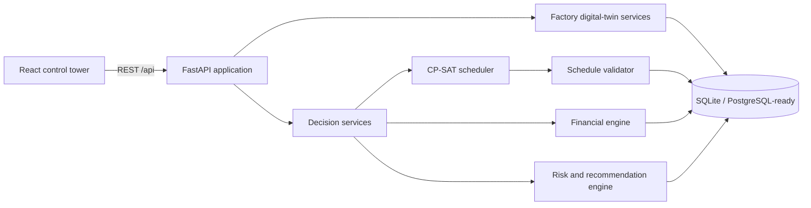

# SmartForge AI architecture

SmartForge is a modular monolith: one React client, one FastAPI service, and one
relational database. This keeps the assessment easy to run while retaining clear
boundaries that can be split later if production load justifies it.

## Backend boundaries

- `models` holds normalized persistence entities and relationships.
- `seed` creates a deterministic, internally consistent 14-machine factory.
- `optimizer` owns scheduling, objective modes, and hard-constraint validation.
- `services` owns costs, capable-to-promise, risks, simulations, and replanning.
- `api` adapts those services to versioned Pydantic REST contracts.

The scheduling layer does not depend on HTTP, and the calculation services use the
same paths for dashboards, RFQs, scenarios, and disruption recovery. That prevents
the UI from showing financially inconsistent numbers.

## Frontend boundaries

- Page-level routes correspond to management workflows rather than database tables.
- Typed API adapters isolate transport and provide an explicit demo fallback when the
  API is unavailable.
- Reusable status, metric, table, chart, and timeline components preserve a compact
  industrial visual language.

## Deployment path

SQLite is the zero-configuration demonstration database. SQLAlchemy keeps the model
portable to PostgreSQL. Docker Compose starts both tiers; a production deployment
would use PostgreSQL, persistent object/log storage, authentication, and a queued
solver worker for long optimization runs.
