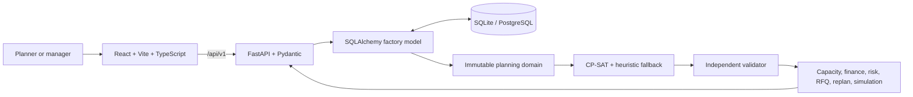

# SmartForge project presentation and implementation approach

This document is a concise, assessment-ready companion to the full [project README](../README.md). It can be submitted as a technical write-up or used as the script for a 7–10 minute project presentation.

## Executive summary

SmartForge is a full-stack manufacturing decision-support system for a finite-capacity automotive machine shop. It combines a React control tower, a FastAPI service layer, a relational factory model, OR-Tools CP-SAT scheduling, independent schedule validation, and transparent financial/risk rules.

The application answers a practical management question: **what should the factory produce, on which resource, at what time, and at what economic risk?** It considers machines, qualified operators, operation precedence, material releases, shifts, maintenance, breakdowns, power availability, generator capacity, sequence-dependent changeovers, customer priority, and late-delivery penalties. The result is a feasible production plan plus an explanation of its delivery, capacity, risk, and profitability consequences.

The demonstration is deterministic and based on a generated Tier-2 supplier scenario. It is a simplified digital twin and decision-support prototype—not a claim of live ERP/MES integration or trained machine-learning prediction.

## Problem and objective

Traditional capacity spreadsheets can show total available hours but cannot prove that individual routed operations fit without resource conflicts. They also tend to separate production planning from the financial consequences of overtime, generator use, outsourcing, changeovers, rework, and late delivery.

SmartForge was built to connect those decisions in one model:

- produce a finite-capacity, conflict-free schedule;
- evaluate whether a new RFQ can be promised without harming existing commitments;
- expose machine, material, power, and skill bottlenecks;
- compare Cheapest, Most On-Time, and Most Robust planning policies;
- replan unfinished work after a disruption while preserving execution history;
- express operational trade-offs and expected losses in INR;
- present the result in a clear control-tower interface for planners and managers.

## Implementation approach

### 1. Model one consistent factory state

The backend represents customers, orders, routed operations, machines, operators, skills, materials, shifts, maintenance, failures, power windows, costs, planning runs, disruptions, and recommendations in SQLAlchemy. A deterministic seed creates a reproducible 14-day scenario with 14 machines, 40 operators, 25 orders, and 96 operations.

All planning services adapt database records into immutable optimizer-domain objects. This keeps the scheduling engine independent of HTTP and persistence concerns and prevents different screens from using contradictory factory assumptions.

### 2. Generate feasible scheduling alternatives

For every unfinished operation, the engine determines the valid combinations of:

- capable machine;
- qualified and available operator;
- allowed calendar window and shift;
- material release time;
- grid or generator power source;
- approved overtime or Sunday recovery period.

Invalid combinations are removed before or constrained during solving. This reduces the search space and makes infeasibility explainable.

### 3. Optimize a finite-capacity plan

The CP-SAT model conceptually selects a machine/operator alternative and start/end interval for each operation. It enforces:

- exactly one valid assignment per scheduled operation;
- machine and operator no-overlap;
- routing precedence;
- machine capability and operator qualification;
- shift, maintenance, breakdown, material, and power calendars;
- shared generator capacity;
- sequence-dependent part-family changeovers.

The objective changes with the selected policy. Cheapest emphasizes operating cost; Most On-Time emphasizes tardiness and customer penalties; Most Robust prices low slack, poor health, high utilization, and fragile skill coverage. A deterministic finite-capacity heuristic supplies an interactive fallback, and both paths must pass the same validator.

### 4. Validate independently

The solver is not treated as the final authority. A separate validator checks every published task for resource overlap, precedence, eligibility, calendar compliance, material release, maintenance/breakdown exclusion, power feasibility, and changeover consistency. A plan is only presented as valid after these checks pass.

### 5. Convert the plan into a business decision

The financial layer uses the schedule to estimate:

> Expected Profit = Revenue − Production Cost − Labour − Overtime − Energy − Generator − Changeover − Maintenance − Rework − Outsourcing − Late Penalties

This matters because maximum utilization is not always the best outcome. Running a bottleneck at 100% can eliminate recovery reserve, and avoiding overtime can cost more in Tier-1 penalties than it saves. The system therefore shows operating cost, expected profit, service level, and risk separately.

### 6. Reuse the same model for RFQs and disruptions

Smart Order Acceptance inserts a proposed order into the existing factory state, tests feasible completion and recovery options, measures displacement risk to committed work, and returns an explainable acceptance or negotiation decision.

Disruption replanning applies a breakdown, absence, material delay, power cut, or rework event from a selected time. Completed and unaffected in-progress work remain frozen; only the remaining plan is regenerated. The UI compares the old and new schedules, including moved work, changed resources, overtime, generator use, penalties, output loss, and incremental cost.

### 7. Design for decision clarity

The React/Vite/TypeScript frontend is organized by operating workflow rather than by raw database table. Executive, planning, execution, recovery, and resource pages use shared industrial design primitives: metric cards, health rings, risk cards, capacity meters, financial bridges, comparison panels, Gantt timelines, tooltips, filters, expandable explanations, and reduced-motion-aware transitions.

The typed API adapter uses the FastAPI `/api/v1` contract. Deterministic frontend fallbacks keep the assessment demo navigable when a local backend is unavailable, while the interface clearly remains a demonstration environment rather than a live machine-control system.

## Architecture at a glance

## What makes the project technically defensible

- **Feasibility before visualization:** the schedule is explicitly assigned in time and independently checked; it is not a decorative Gantt.
- **Shared planning truth:** schedule, RFQ, capacity, risk, scenario, and profitability logic operate on the same domain representation.
- **Transparent claims:** health and risk scores are deterministic rules and seeded probabilities, not mislabeled predictive ML.
- **Explainable economics:** overtime, energy, generator use, changeovers, rework, outsourcing, and penalties are visible rather than hidden inside a score.
- **Auditable recovery:** replanning freezes executed work and reports the before/after schedule and cost delta.
- **Deployable separation:** the frontend, REST API, persistence layer, optimizer, validator, and services can be tested and evolved independently.

## Presentation outline and speaker notes

### Slide 1 — SmartForge: the factory decision control tower

**Show:** Executive Dashboard.

**Say:** “SmartForge turns a constrained machine-shop state into a feasible two-week schedule and explains the delivery, risk, capacity, and profit impact of that plan.”

### Slide 2 — Why this problem is difficult

**Show:** Factory Control Tower and the critical grinder bottleneck.

**Say:** “A free machine is not real capacity if the material is late, the operator is unqualified, the power is unavailable, or a predecessor operation is incomplete. Total-hours spreadsheets miss these interactions.”

### Slide 3 — One factory model

**Show:** Architecture diagram or the Machines, Workforce, and Orders pages.

**Say:** “The same database-backed factory snapshot drives scheduling, capacity, order acceptance, risk, profitability, simulation, and replanning. That consistency is the core architecture decision.”

### Slide 4 — Finite-capacity scheduling

**Show:** Production Schedule Gantt and open an operation detail panel.

**Say:** “CP-SAT selects a compatible machine, qualified operator, and time interval while enforcing no-overlap, routing precedence, material, shifts, maintenance, breakdown, power, generator capacity, and family changeovers. A separate validator checks the published plan.”

### Slide 5 — Smart Order Acceptance

**Show:** Smart Order Acceptance; evaluate a strategic Tier-1 RFQ.

**Say:** “The order is tested against committed work rather than against an empty factory. The recommendation combines feasible completion, bottleneck hours, delivery confidence, recovery cost, contribution margin, and displacement penalties.”

### Slide 6 — Risk and constrained capacity

**Show:** Problems & Risk Center, then Capacity Planning.

**Say:** “Risks combine probability, impact, affected orders, and expected INR exposure. Capacity is reported for both machines and qualified skills, so an operator dependency is visible before it becomes a delivery failure.”

### Slide 7 — Disruption and replanning

**Show:** Disruption Control Center; inject an eight-hour `GRIND-01` failure and run replanning.

**Say:** “Completed work remains frozen. The engine blocks the failed interval, reschedules remaining operations, validates the new plan, and explains moved jobs, new completion dates, recovery actions, and incremental cost.”

### Slide 8 — Policy trade-offs

**Show:** Schedule Comparison.

**Say:** “Cheapest, Most On-Time, and Most Robust are deliberately different management policies. The comparison keeps expected profit, penalties, overtime, generator use, delivery rate, and resilience visible so the planner chooses the trade-off rather than accepting a black-box score.”

### Slide 9 — Industrial SaaS experience

**Show:** Machine Health, Energy, Profitability, and Today’s Production Board.

**Say:** “The interface uses a shared industrial design system and role-oriented workflows. Managers see financial exposure, planners see schedules and capacity, maintenance sees health priorities, and supervisors get an execution-focused board.”

### Slide 10 — Outcome, limits, and next step

**Show:** Owner’s Next Call or return to the Control Tower.

**Say:** “The prototype demonstrates an auditable path from factory data to an operational recommendation. The data is generated and health logic is rule-based. Production adoption would require ERP/MES/CMMS and telemetry integration, calibrated probabilities, authentication, audit controls, and shadow-mode validation.”

## Suggested closing statement

“The main engineering contribution is not a dashboard or a solver in isolation. It is the connection between a validated finite-capacity plan and the business decision: whether to accept an order, protect a customer promise, authorize overtime or generator use, recover from a disruption, or invest in constrained capacity.”

## Likely reviewer questions

**Why CP-SAT instead of a spreadsheet or linear capacity calculation?**  
The problem includes discrete assignment, time intervals, no-overlap, precedence, alternative resources, calendars, and sequence effects. CP-SAT represents those choices directly; aggregate capacity arithmetic cannot prove a collision-free plan.

**Is the project using machine learning?**  
No trained model is claimed. Optimization creates schedules; deterministic rules and seeded probabilities estimate health/risk for the demo. Real telemetry could later support calibrated predictive models.

**What happens if the solver times out?**  
The system can retain the best valid incumbent or use its deterministic finite-capacity heuristic. Either result must pass the same independent validator before publication.

**Why not always maximize utilization?**  
Very high utilization can increase queueing and remove recovery slack. A slightly more expensive plan may protect more contribution margin by avoiding a strategic late-delivery penalty.

**How would this reach production?**  
Replace generated data with governed ERP/MES/CMMS interfaces, move persistence to PostgreSQL, run optimization in queued workers, version immutable planning inputs/results, add RBAC and audit, calibrate costs and uncertainty, and validate recommendations in shadow mode before enabling operational approvals.

## Supporting project documents

- [PowerPoint presentation (download)](presentation/SmartForge-Technical-Presentation.pptx)
- [Complete project and user guide](../README.md)
- [Architecture](architecture.md)
- [Scheduling model](scheduling-model.md)
- [Assumptions and limitations](assumptions.md)
- [Live defense question bank](defense-guide.md)
- [Management trade-off memo](tradeoff-memo.md)
